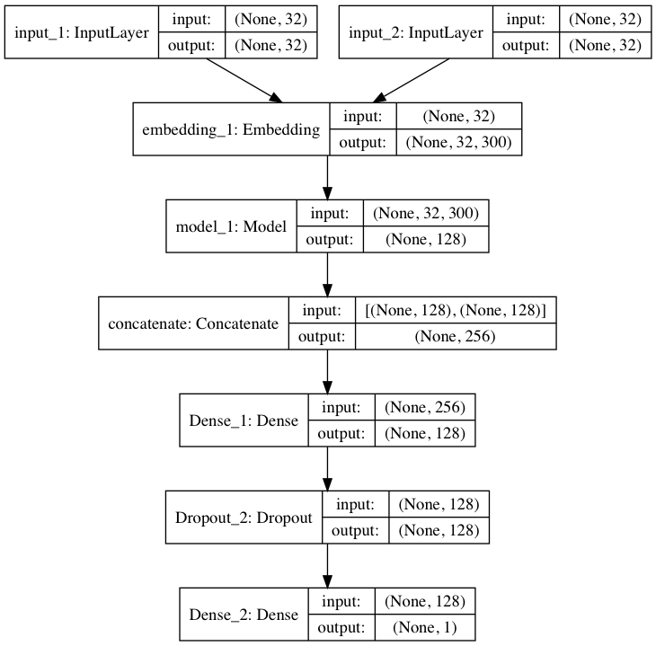

[Quora Question Pairs](https://www.kaggle.com/c/quora-question-pairs)

# 一、经典机器学习算法

> 包括Quora-Vectorizer.ipynb和Quora-Feature-Enginnering.ipynb，不同阶段做的，各有侧重

## 数据清洗

- 转化为lower
- 把"What's your name?"转化为“What's your name ? ”,符号加入空格，避免分割出"name?"这样的单词。不过这步尝试结果欠佳
- 鉴于上一条结果欠佳，索性直接去掉所有标点符号。结果也欠佳
- 尝试把一些缩写改为全写，比如"I've"改为"I have"，"It'll"改为"It will"，效果欠佳

## Feature Engineering

### 问题特征提取

- 问题长度
- 独立单词数量
- 2个问题公共单词数量
- 2个问题公共比例（加smooth）

额外还尝试了如下，不过效果欠佳

- 排除掉English StopWord，效果欠佳，因为有些stop word，比如What，在这个case中是比较重要的词汇
- 排除Google News使用的Vocabulary，排除掉不常用的所有单词，包括标点符号，同时也排除了Snapchat类似的新词汇，效果欠佳。

### ngrams

提取2-grams和3-grams，统计公共pair数量和比率，效果有提升。

### 问题类型提取

根据首单词，比如what, how, where，提取问题的性质。是问what的，还是how的，还是一般疑问句。效果有提升。

### 检测符号

检测是否有问号，效果下降。

## Vectorizer

使用`sklearn.feature_extraction.text`的`CountVectorizer`和`TfidfVectorizer`，参数见

```
class sklearn.feature_extraction.text.CountVectorizer(
input='content', encoding='utf-8', decode_error='strict', 
strip_accents=None, lowercase=True, preprocessor=None, 
tokenizer=None, stop_words=None, token_pattern='(?u)\b\w\w+\b', 
ngram_range=(1, 1), analyzer='word', 
max_df=1.0, min_df=1, max_features=None, 
vocabulary=None, binary=False, 
dtype=<class 'numpy.int64'>)
```

```
class sklearn.feature_extraction.text.TfidfVectorizer(
input='content', encoding='utf-8', decode_error='strict', 
strip_accents=None, lowercase=True, preprocessor=None, 
tokenizer=None, analyzer='word', stop_words=None, 
token_pattern='(?u)\b\w\w+\b', ngram_range=(1, 1), 
max_df=1.0, min_df=1, max_features=None, 
vocabulary=None, binary=False, 
dtype=<class 'numpy.int64'>, 
norm='l2', use_idf=True, smooth_idf=True, sublinear_tf=False)
```

- `lowercase=True`，转化为小些
- `analyzer='word'`，可以是word，或者n-grams，也可以自定义，自己从raw input sequences中提取信息feature，比如通过Porter Stemming等
- `preprocessor=None`,预处理，可以做很多事情，扩展性很强
- `tokenizer=None`，如果`analyzer='word'`时work，覆盖字符串tokenization step。
- `stop_words=None`, 可以是'english'，这些stop word会被忽略掉
- `max_features=None`，vocabulary的大小

自定义analyzer

```
from sklearn.feature_extraction.text import CountVectorizer
from nltk.stem.snowball import EnglishStemmer

count_analyzer = CountVectorizer().build_analyzer()
stemmer = EnglishStemmer()

def stem_count_analyzer(doc):
    return (stemmer.stem(w) for w in count_analyzer(doc))
# 其实就是自己build一个analyzer，然后stem一下
```

## Error Analysis

在Feature Engineering的过程中，不断查看被排除在vocabulary中的词汇，按频率倒序排序，关注多数。不断归纳总结新的feature。

## 训练模型

`Quora-Vectorizer.ipynb`使用多种模型，并绘制learning curve。

`Quora-Feature-Enginnering.ipynb`使用XGBoost，等待converge后的最小validation log loss作为模型评判标准。

# 二、神经网络算法

## 2.1 数据预处理

- train中dropnan，test中nan替换为空字符串
- 去除Stop Words
- 使用EnglishStemmer做转换
- 使用GoogleNews-vectors做Embeddings weights
- keras.preprocessing.text中Tokenizer和pad_sequences做预处理

## 2.2 神经网络模型



- 首先做Embedding，由于使用已有数据源，所以trainable=False
- 在LSTM层前尝试卷积网络，试图提取更高维度有价值信息，不过最终效果不佳
- 共享参数LSTM
- Dense、Dropout、BatchNormalization提升泛化性能

## 2.3 训练调参

- 使用TensorBoard，每次run记录到不同的日志文件夹
- ModelCheckpoint记录最佳logloss时的weights
- EarlyStopping提前结束训练
- 不断尝试，不断调参。可以选择一个较小的数据集训练，以便快速迭代